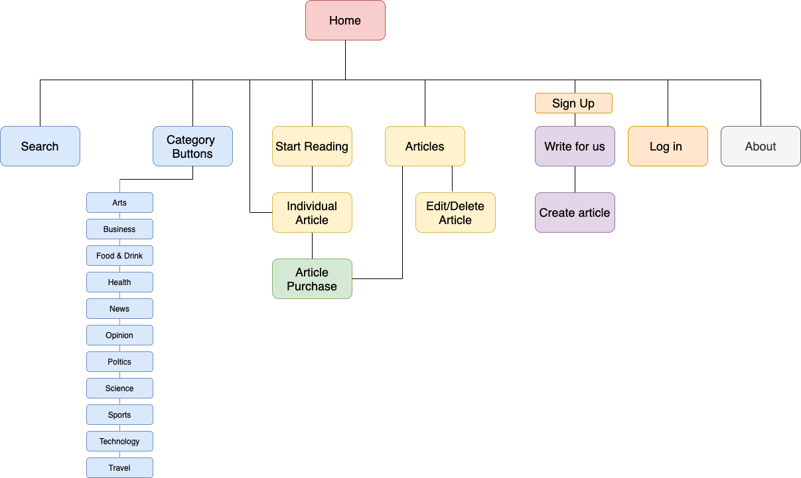
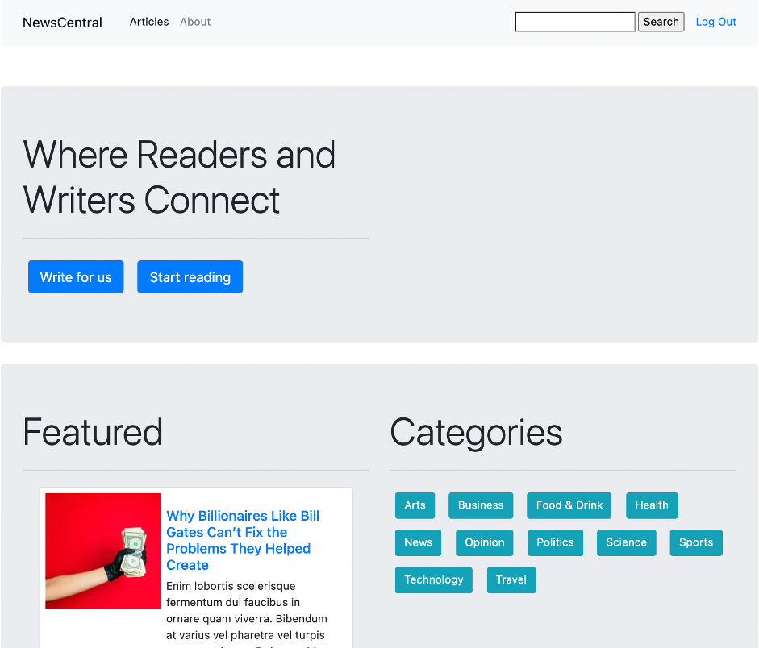
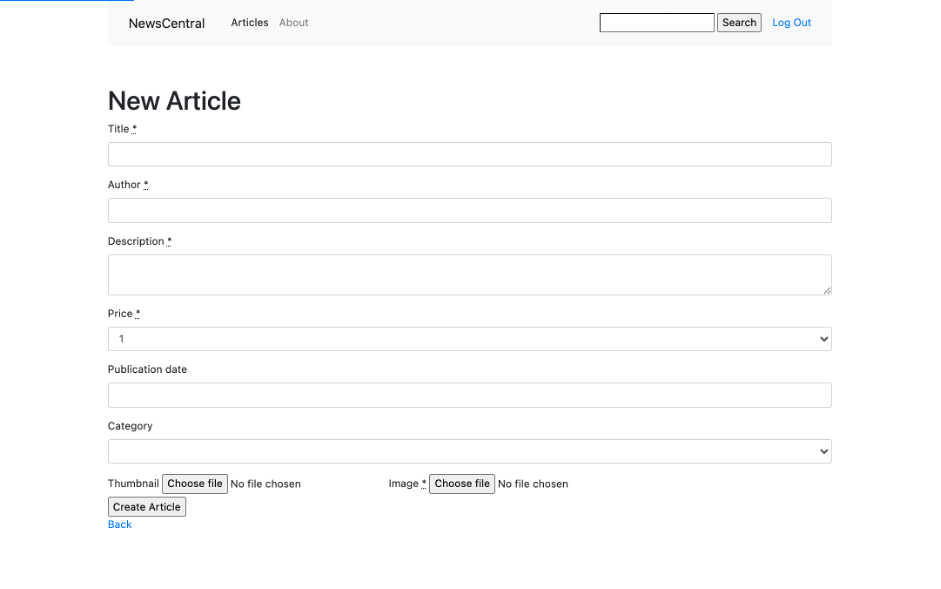
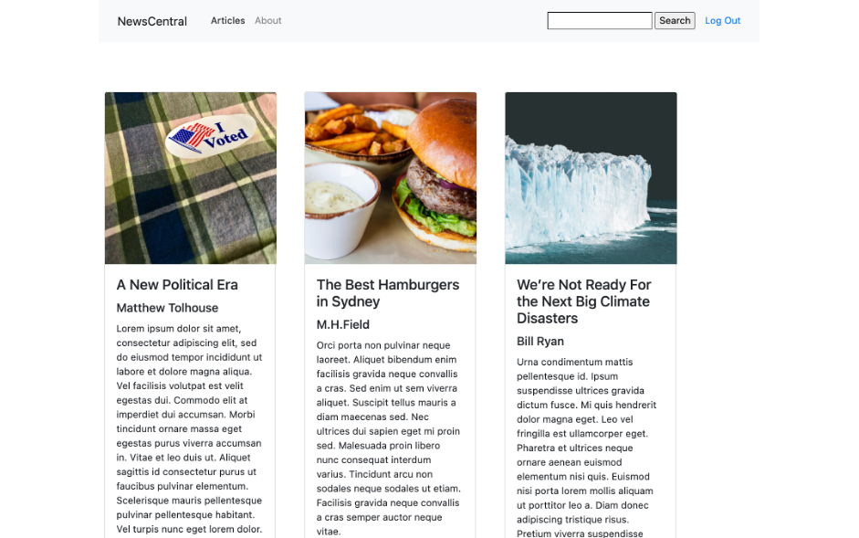
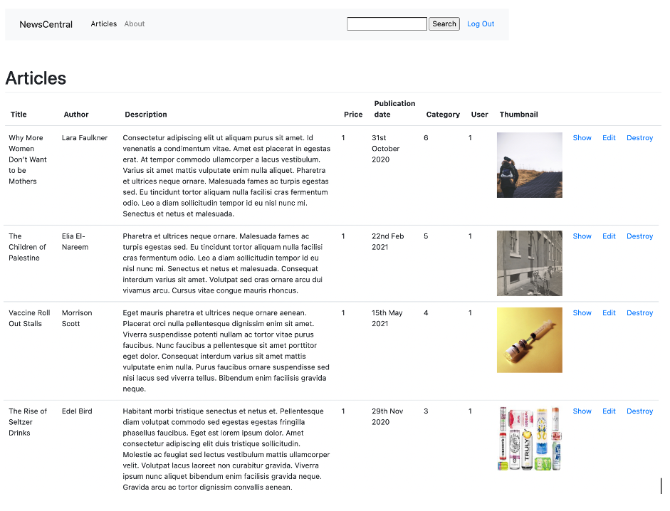
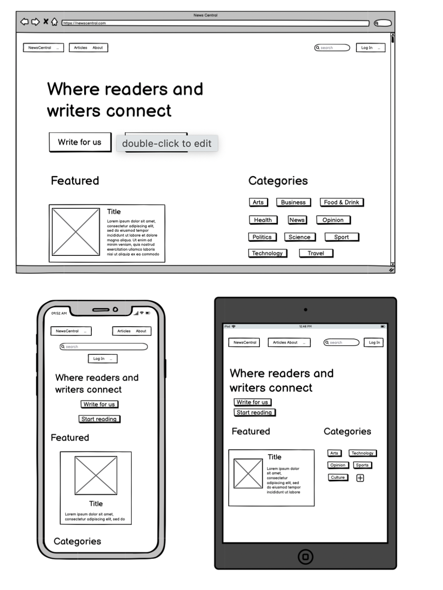
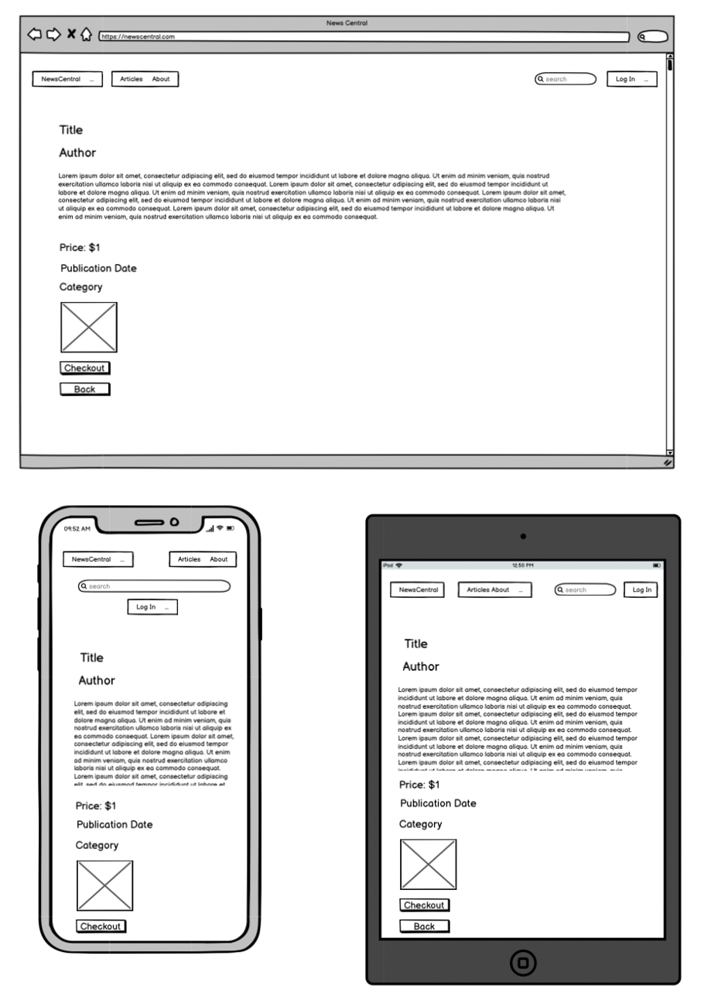
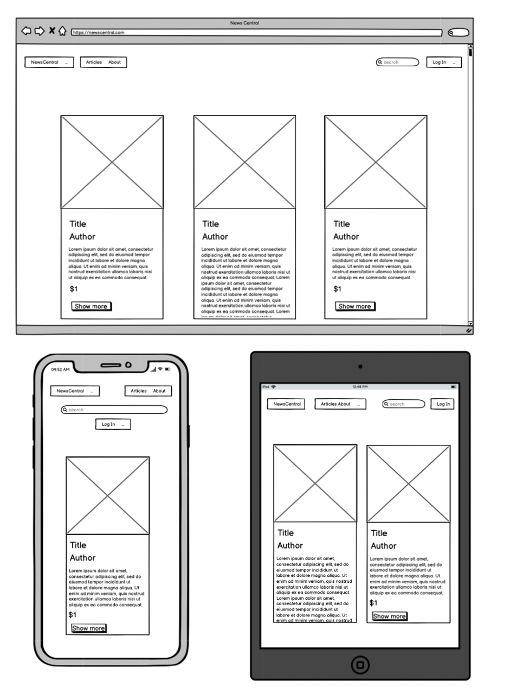
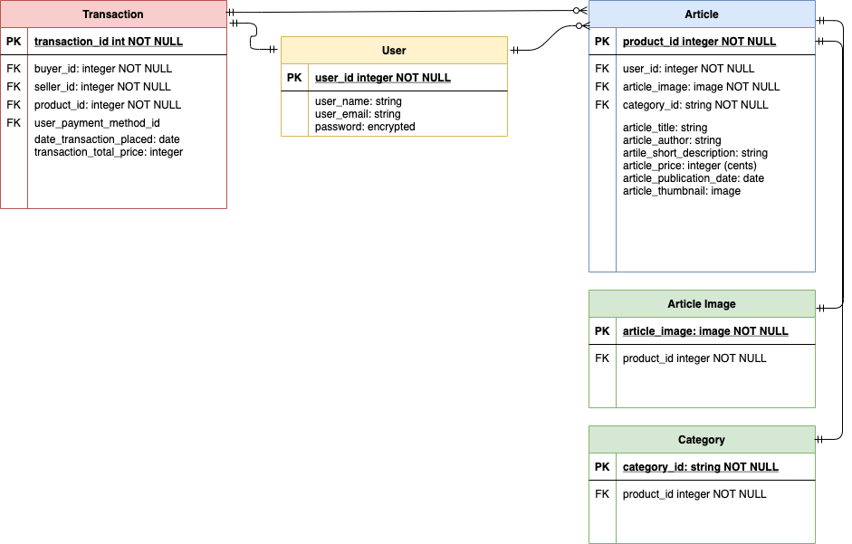

# T1A3 - Sarah Cahill

## Marketplace app - News Central


Link to website: https://newscentral1.herokuapp.com/ 
<br>
Link to github: https://github.com/sarcah/meme_store_app1 

<br>

#### R7 and R8. What problem does it solve, and why is it a problem?

In recent years, the way people consume news has changed drastically. Customers can now consume news either online or through physical means, paid or free, from news websites or through social media. More and more established news organisations are moving to make their content only accessible through paid subscriptions. This can get expensive for customers who are large consumers of news, or who like to read work from particular journalists who work at different media organisations. 

This app would allow a large marketplace or library of articles that users could browse, and simply pay for the articles they want to read for a small fee per article, providing another option rather than having to subscribe to multiple news organisations. The fee is purposely set low to make the barrier to purchase low – the model aims to make multiple purchases easy, attractive and low risk to the consumer. 

The app also aims to create an additional sustainable income stream for journalists, who have experienced massive job losses in recent years, and allows them to build a brand following and increased readership. The app would also allow them rights to their own work, and so maintain their IP. Rather than posting articles on Twitter and not being recompensed for their work, News Central assigns value to every article and to journalists work, and to defy the expectation that news is now ‘free’.

Ideally, this app would also employ fact checkers before articles were posted to remove the risk of ‘fake news’, so readers would know there was a quality standard of articles that were posted. This may also involve only allowing registered journalists to be able to post. Further development of the app could involve getting alerts for when a particular journalist posts an article, and algorithms to suggest possible future reading. The app also purposely does not sort articles by how many times they have read, to avoid the practices of writing ‘click bait’ articles. Another development would be allowing users to rate articles once they have read them and use this for the search algorithm. 

A company called Substack was founded in 2017, which allows journalists to create paid newsletters that customers can subscribe to, which does solve some of the above problems. However this does mean that customers can get multiple emails and does not allow them to ‘pick and choose’ which articles they would like to read as News Central does.

<br>

#### R11 Description of site

**Purpose**
The purpose of News Central is to connect buyers and sellers of articles by providing a user friendly marketplace where buyers are able to pick and choose what articles they read, rather than having to subscribe to multiple media organisations. Journalists are able to list their articles and sell their work directly to users, and create new revenue streams.

**Functionality/Features**
*UX*: A clean, functional User Experience has been implemented throughout the marketplace with clear and simple design. Users are able to either search by keyword, browse by category, or browse overall articles. They can read the first paragraph of the article before deciding if they want to purchase. Users are able to access the articles by clicking the 'Start Reading' button on the homepage, which takes them to articles displayed in an easy to browse format. They can also access the full table of articles from the link in the navbar. 

*Account*: The Devise Ruby gem has been implemented for authentication and authorisation. Users only have to create an account in order to upload an article - this is purposely done, to remove any barrier to purchase. A User does not have to be logged in to browse the site or buy an article. Once a user has signed up and created an account, they can write an article and access the article index (accessed from the navigation bar), where they will only be able to edit and delete articles they have created, and simply view all other articles.  

*Articles*: There are two ways to access the Articles from the homepage. The link in the navbar takes the User to an article index (as mentioned above), and the Start Reading button takes them to a more more appealing article show page, where the articles are displayed in card format in order to encourage users to persuse the selection. The category buttons on the front page also allow users to quickly filter by category. The homepage also contains a featured article to showcase the format (that is selected at random each time the page is refreshed), and to encourage users to click through to rest of site. 
Note: for creation of an article, there is not nearly enough instructions to the user or restrictions on what can be entered, this would need to be improved on in the next round of coding for site.  

*Adding to cart*: Users can purchase article from the ‘show’ page, and be taken to stripe checkout. Upon completion of payment, they will receive an automatic download of article pdf. The checkout process currently ends there, but future iterations of the site would see users taken to a 'purchase successful' page.

**Sitemap**


**Screenshots**

Homepage 


Write an article


Browse article


Article page


Article index


**Target audience**
The target audience for this app is readers who enjoy quality journalism, and want to be able to pick and choose the articles they read, rather than have to commit to a subscription. As sellers, it also targets journalists looking to supplement their incomes, create a new revenue stream, attract new readers and build their brands.

**Tech stack**
*Front end technologies*: HTML5, CSS, SCSS, ERB, Bootstrap, JavaScript
*Back-end technologies*: Ruby 2.7.2 and Ruby on Rails 6.1.3.2
*Database*: PostgreSQL, AWS
*Gems*: Bootstrap, Simple Form, Devise
*DevOps*: Git, Github, VSCode, Bundler, Homebrew, Yarn.
*Business tools*: Balsamiq, diagrams.net, Trello
*Deployment*: Heroku

<br>

#### R12 User Stores

**Authentication**
•	As a user, I have the ability to sign up for an account to login.
•	As a user, I can use my email and password to log in to the app.
•	As a user, I can log out of my account at any point.
•	As a user, I can browse articles to read but must log in to be able to write an article.

**Article Listings**
•	As a user, I can navigate from the homepage to browse articles.
•	As a user, I can search articles by keyword (searching by title and/or author).
•	As a user, I can use buttons on home page to filter by author.
•	As a user (seller), I have the ability to navigate from the homepage to create a listing to sell an article.
•	As a user (seller), I alone have the ability edit my articles.
•	As a user (seller), I alone have the ability delete my articles.

**Transactions**
•	As a user, I have the ability to buy an article, pay for it, and then receive a download as soon as payment goes through. 

<br>

#### R13 Wireframes

Wireframes – home page



Wireframes – item page



Wireframes – read page



<br>

#### R14 ERD



<br>

#### R15 Explain the different high-level components (abstractions) in your app

The app is built with a basic MVC, with the high level components of Articles, Categories, Users and Transactions. 
**Articles** – the central proposition of the app. The article can be created, edited and deleted by a User, shown as for sale and bought. The product is entirely digital. The writer or journalists can spend months writing an article, and a minute to create the article on the webpage, given it a form that can be shared and purchased. The article should still be thought of as a physical item that can be described and browsed. The benefit of being a digital product, once the payment is processed and the article is downloaded, the transaction is complete, with immediate gratification to the customer. 
**Categories** – these were created to ensure uniformity when uploading a new article, and also as a way of sorting the data and making it meaningful. Replicating the way a user would read a real life newspaper (where articles on similar topics are grouped together), these allows for ease of browsing and an easier path to purchase.
Users – used for authentication and to create and purchase articles. Permission in the app vary based on user logged in, and allow users to interact with the application. They can be both buyers and sellers, both consumers and providers of content, or choose just to be a reader or a writer. 
**Transactions** – the purpose of the app is to create new revenue for journalists, so the Transaction is the component where money changes hands and value is assigned to the content. As stated previously, this app aims to change the perception that news should be ‘free’, so the transaction is an important part of assigning inherent value to content.

The controllers provided the site with functionality, allowing all data to be accessed and made meaningful. The views ensure the data and functions are presented to the user in a meaningful way that they can interact with it. Various pre-packaged gems ensure this app’s functionality runs smoothly, eases code creation and ensure the shopping experience is a smooth one for the consumer, allowing the app to achieve it’s central purpose of making money for writers. 

<br>

#### R16 Third party services

*Bootstrap*: the bootstrap styling framework was used for ease of design and consistency.
*Simple form*: being utilised throughout the application for handling all required form fields.
*Devise*: handles all authentication
*AWS S3* – used for storage of images uploaded to site
*Stripe* – built in payment system
*PostgreSQL* – database management system to store user and article information.
*Heroku* – used for deployment

<br>
#### R17 Models Used:

**Articles, Categories, Transactions and User**.

The **Article** model has the product_id as the primary key, and user_id, article_image and category_id as foreign keys (to note: images are not usually used as foreign keys, but must be in this instance because it is the digital download and forms the product being sold). The relationship is represented in the Article model as:
```belongs_to :user```

The **Category** serves as a foreign key, and belongs to the Article. 

The **Transaction** model belongs to the Article, and to the buyer and seller of the User. This is represented as:
`belongs_to :seller`
`belongs_to :buyer `
`belongs_to :article`

A registered **User** can have many articles, though a listing can have only one user. This is represented in the User model as:
`has_many :articles`

The **User** also has foreign keys of buyer and seller, so can have many sales and purchases.
`has_many :sales`
`has_many :purchases`

<br>

#### R18 Database relations


The **User** model contains the primary key of user_id. This was initially created through the Devise gem, and then had a buyer and seller id created so the marketplace can be two sided. 

```
has_many :sales, foreign_key: :seller_id
has_many :purchases, foreign_key: :buyer_id
```

The Devise gem also provides authentication, so users must enter an email address and a password.

When a **User** creates an **Article**, the below fields are required to ensure consistency (and that there is a product to sell).

```
belongs_to :user
has_one_attached :image
has_one_attached :thumbnail
has_one :category
validates :image, :title, :author, :price, :description, presence: true
```

<br>

#### R19 Provide your database schema design:

```
create_table "active_storage_attachments", force: :cascade do |t|
    t.string "name", null: false
    t.string "record_type", null: false
    t.bigint "record_id", null: false
    t.bigint "blob_id", null: false
    t.datetime "created_at", null: false
    t.index ["blob_id"], name: "index_active_storage_attachments_on_blob_id"
    t.index ["record_type", "record_id", "name", "blob_id"], name: "index_active_storage_attachments_uniqueness", unique: true
  end

  create_table "active_storage_blobs", force: :cascade do |t|
    t.string "key", null: false
    t.string "filename", null: false
    t.string "content_type"
    t.text "metadata"
    t.string "service_name", null: false
    t.bigint "byte_size", null: false
    t.string "checksum", null: false
    t.datetime "created_at", null: false
    t.index ["key"], name: "index_active_storage_blobs_on_key", unique: true
  end

  create_table "active_storage_variant_records", force: :cascade do |t|
    t.bigint "blob_id", null: false
    t.string "variation_digest", null: false
    t.index ["blob_id", "variation_digest"], name: "index_active_storage_variant_records_uniqueness", unique: true
  end

  create_table "articles", force: :cascade do |t|
    t.string "title"
    t.string "author"
    t.text "description"
    t.integer "price"
    t.string "publication_date"
    t.string "date"
    t.datetime "created_at", precision: 6, null: false
    t.datetime "updated_at", precision: 6, null: false
    t.bigint "user_id", null: false
    t.bigint "category_id", null: false
    t.index ["category_id"], name: "index_articles_on_category_id"
    t.index ["user_id"], name: "index_articles_on_user_id"
  end

  create_table "categories", force: :cascade do |t|
    t.string "name"
    t.datetime "created_at", precision: 6, null: false
    t.datetime "updated_at", precision: 6, null: false
  end

  create_table "transactions", force: :cascade do |t|
    t.bigint "seller_id", null: false
    t.bigint "buyer_id", null: false
    t.bigint "article_id", null: false
    t.integer "amount", default: 0
    t.datetime "created_at", precision: 6, null: false
    t.datetime "updated_at", precision: 6, null: false
    t.index ["article_id"], name: "index_transactions_on_article_id"
    t.index ["buyer_id"], name: "index_transactions_on_buyer_id"
    t.index ["seller_id"], name: "index_transactions_on_seller_id"
  end

  create_table "users", force: :cascade do |t|
    t.string "email", default: "", null: false
    t.string "encrypted_password", default: "", null: false
    t.string "reset_password_token"
    t.datetime "reset_password_sent_at"
    t.datetime "remember_created_at"
    t.datetime "created_at", precision: 6, null: false
    t.datetime "updated_at", precision: 6, null: false
    t.index ["email"], name: "index_users_on_email", unique: true
    t.index ["reset_password_token"], name: "index_users_on_reset_password_token", unique: true
  end
  ```

<br>

#### R20 Tracking Tasks

This project has been tracked and managed using Trello: https://trello.com/b/9y1AYpIL/t2a2-marketplace. 
General cards were created with details and checklists inside each card, detailing the task that would need to be done, what tools were needed, and checklists ensuring all requirements were met. Stretch goals were put in Backlog. Colour coding was implemented for ease of use.


